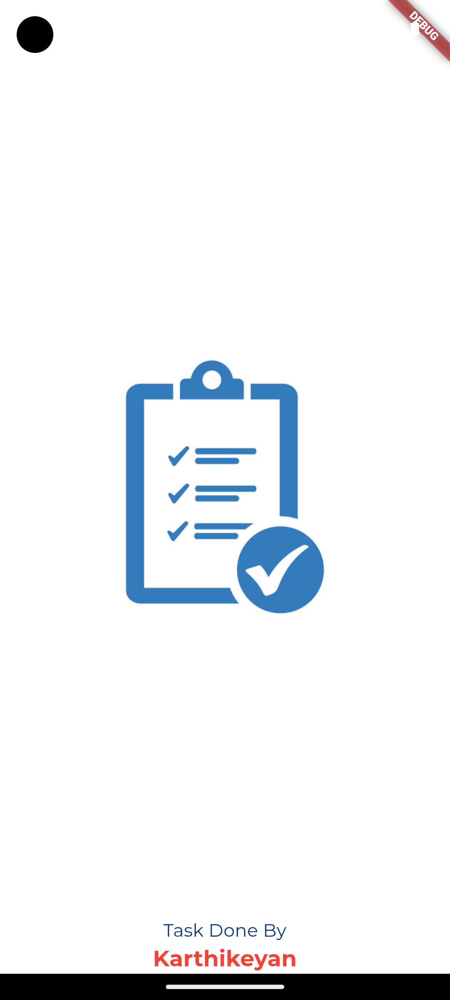
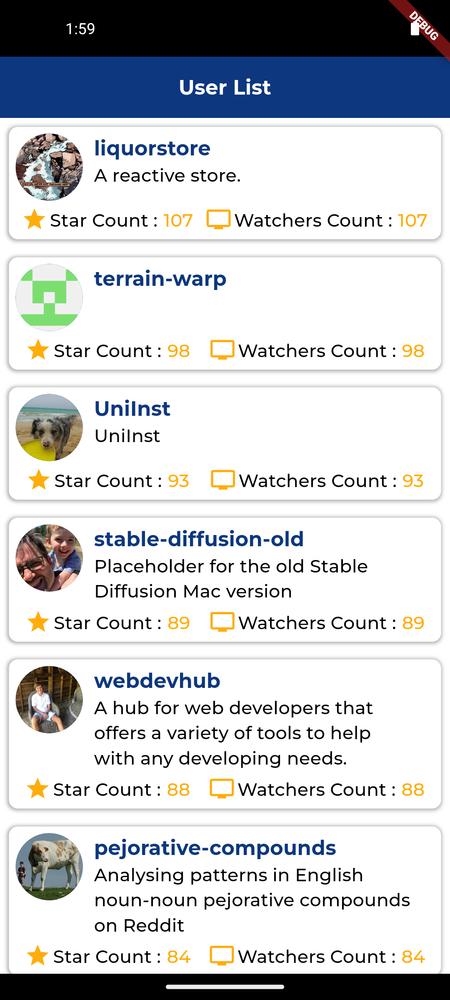
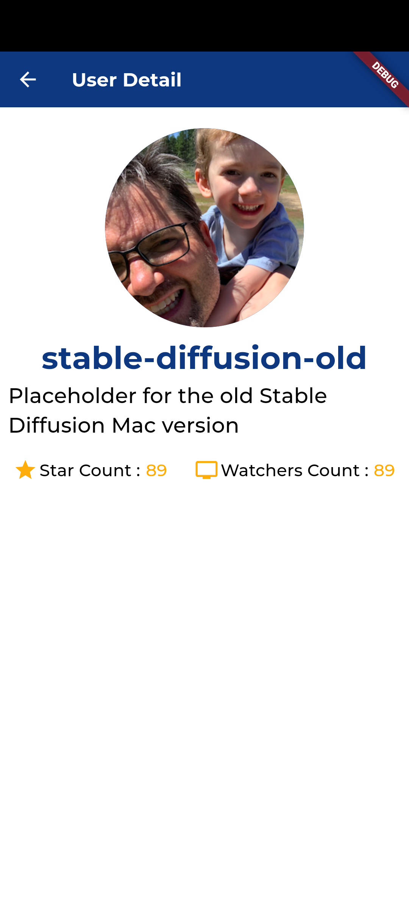

# uiapi_design_thiran

A new Flutter project For Thiran with GitHub Api Integration Using Riverpod.

## Preview

## Screenshots

<h2 id="Outputs">Outputs</h2>
<p>



</p>

## Getting Started

This project is a starting point for a Flutter application.

To get a local copy up and running follow these simple example steps.

1. To get started, fork this repository to your GitHub account.

2. Clone the repo.
   ```sh
    git clone https://github.com/karthiKN-sk/uiapi_design_thiran.git
   ```
3. Install packages.
   ```sh
    flutter clean
   ```
4. Install packages.
   ```sh
    flutter pub get
   ```
5. Run project.
   ```sh
    flutter run
   ```

## Author

👤 **Karthikeyan K**

- Github: [@karthiKN-sk](https://github.com/karthiKN-sk)
- LinkedIn: [@karthikeyansk](https://www.linkedin.com/in/karthikeyansk/)

A few resources to get you started if this is your first Flutter project:

- [Lab: Write your first Flutter app](https://docs.flutter.dev/get-started/codelab)
- [Cookbook: Useful Flutter samples](https://docs.flutter.dev/cookbook)

For help getting started with Flutter development, view the
[online documentation](https://docs.flutter.dev/), which offers tutorials,
samples, guidance on mobile development, and a full API reference.
